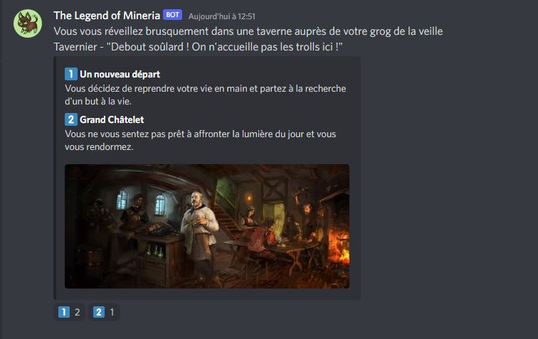
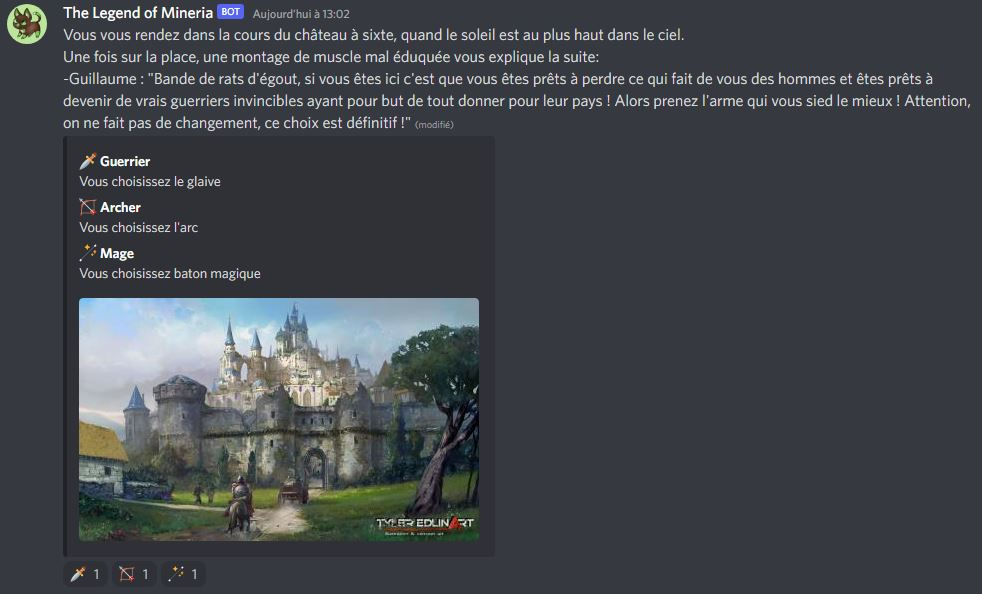
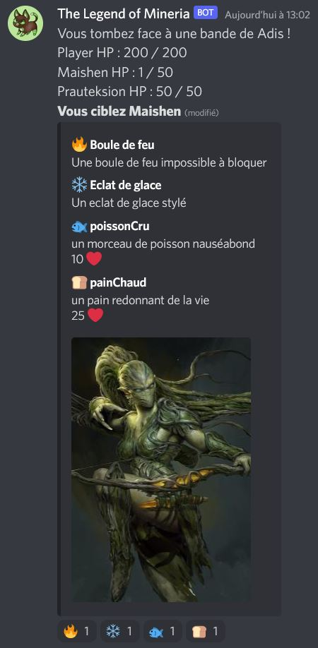
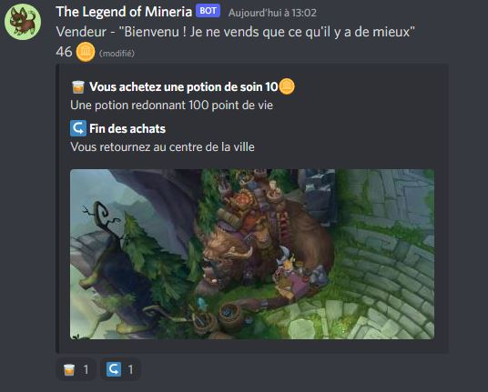
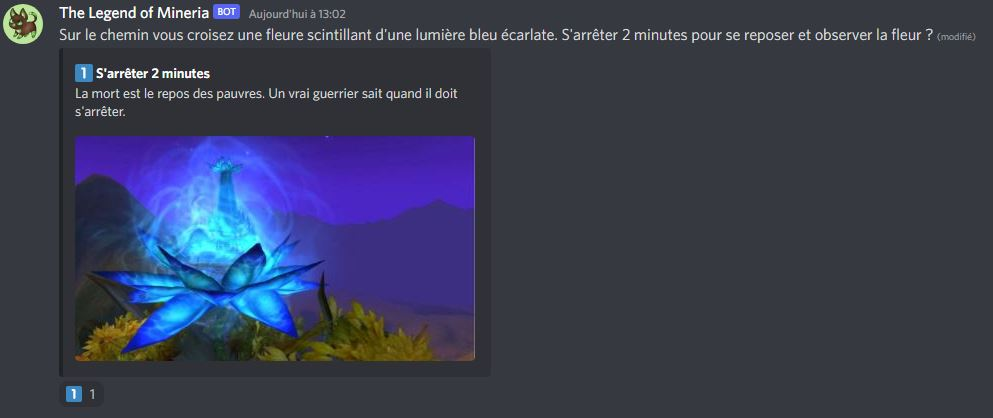
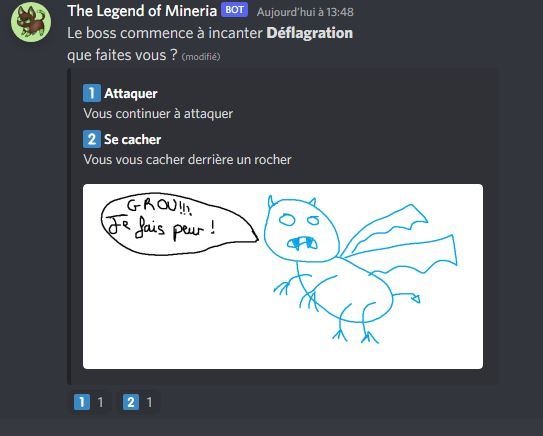

# Comment jouer

## Participer à un évennement
  
Pour participer à un évement, il suffit d'utiliser les réactions sous le message envoyer par le bot.   
La signification de chaque choix est décrit dans le message.  
Dès qu'une réaction a atteint le nombre de vote requis, le choix est validé et le message se mettra à jour.

## Nombre de vote requis
Le nombre de vote requis est choisis par un adminastrateur du serveur, il est visible (et modifiable pour un administrateur) via la [page mon compte du site](http://152.228.175.11/discord-rpg/website/mon-compte.php).

## Les classes
  
Après les quelques quêtes du début vous allez choisir une classe, attention ce choix sera définitf !
  - Le guerrier a la particuliarité d'avoir une forte armure réduisant beaucoup les dégâts qu'on lui porte, cepedant il est difficile pour lui d'esquiver les attaques
  - L'archer quant à lui possède une armure moyenne atténuant un peu les dégâts reçus, avec un chance moyenne d'esquiver les coups
  - Le mage en revanche a la possibilité d'equiver régulièrement les attaques qui lui sont portées, néanmoins sa faible armure protège peu des dégâts

## Les combats
  
Le monde de Mineria se revèle être très hostile et vous allez croiser beaucoup d'ennemis lors de votre aventure, vous allez alors devoir combattre !  
Lors d'un combat vous allez d'abord devoir choisir quel ennemi cibler (si plusieurs ennemis sont présents) puis quelle attaque utiliser.  
Si vous possédez des consommables vous aller alors pouvoir vous en servir pour regagner des points de vies !

## Acheter des objets
  
Afin de faciliter vos affrontement il ne faudra pas hésiter à utiliser vos pièces d'or afin d'obtenir des objets qui pourront vous aider !

## Monter ses niveaux et acquérir de l'équipement
A force de gagner de l'expérience en réalisant des quêtes ou en accomplissant des combats vous allez monter des niveau, augmentant vos statistiques, si un combat vous semble trop difficile alors il vaut mieux revenir en arrière pour augmenter ses niveaux et revenir en étant plus puissant.  
Lors des combats ou via des coffres vous allez obtenir des équipements, si ce dernier ce revèle être plus puissant que ce que vous avez actuellement, alors il sera automatiquement équipé !  
Afin de progresser dans l'aventure il ne faudra donc pas refuser le danger, seulement cela n'est pas sans risques...

## La mort
  
Si une adversaire se montre plus fort que vous et arrive à descendre vos points de vies à zéro, alors vous aller mourir et revenir à votre dernier point de résurrection.
Cela peut également arriver lors de certains évements spéciaux (lorque vous chuttez au fond d'un grouffre par exemple).

## Les points de résurrection
  
Au fil de votre aventure vous allez croiser plusieurs des fleurs bleues, il est alors possible de se reposer pendant deux minutes auprès d'elles afin d'enregistrer un point de resurrection, cela regenère églament tous vos points de vies.

## Les boss
  
Les boss sont des combats spéciaux, ils ont la particuliarité d'avoir accès à certaines attaques destructrices, faîtes le bon choix si vous tenez à la vie !
